# DISTRIBUTED SYSTEMS ASSIGNMENT REPORT


**Assignment ID: ** 1

**Student Name:** 徐春晖 XU Chunhui

**Student ID:** 12110304

## DESIGN

### Distributed Idea

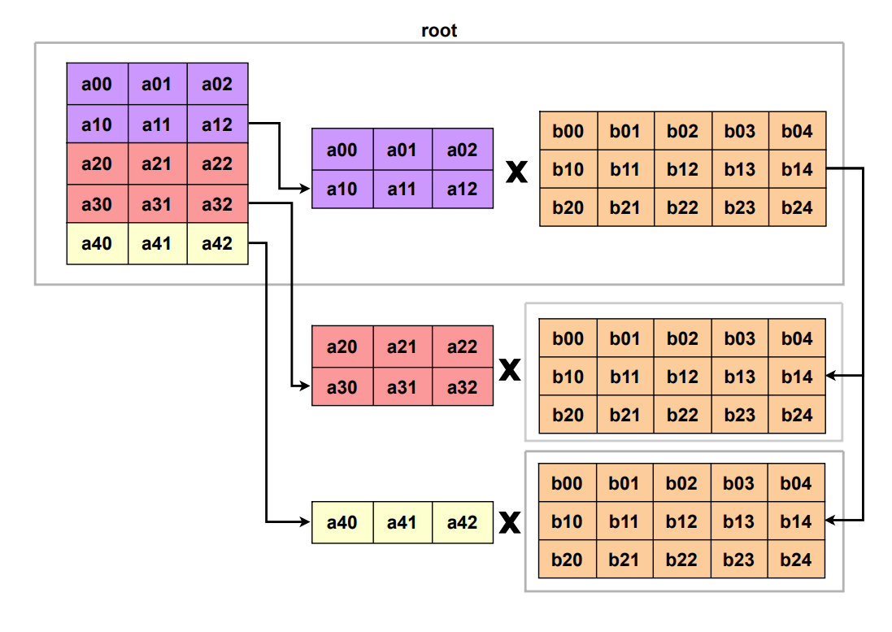

Just follow the instruction, I implemented my distributed idea in the following way: I divided the $A$ matrix into rows and distributed some rows of $A$ to different distributed computing units; and the entire content of the $B$ matrix was distributed to the computing units.

For the computing node $u$, if it gets the rows in Matrix $A$ from row $u_{s}$ to $u_{e}$, its computing task is:
$$
A[i][j] * B[j][k] = C[i][k](u_{s} \leq i\leq u_{e}, \forall j,k)
$$
While Matrix $C$ is the computation result.

Finally, combine the results from different computing units then get the whole result matrix $C$.

Because the focus of my exploration in this assignment is on distributed strategies and their performance comparison, I only ensured that each part used the same calculation strategy and **did not introduce various different matrix multiplication optimization methods**.

## DESIGN IMPLEMENTATION

### Initial Matrix Generation Strategy

I changed the strategy for generating the initial matrix elements so that each generated initial element has a float part $e_i$ satisfies $e_i \in [0, 1]$, giving full play to the calculation characteristics of the C language `double` type.

```c
// for (int i = 0; i < MAT_SIZE; ++i)
//     for (int j = 0; j < MAT_SIZE; ++j) {
//         a[i * MAT_SIZE + j] = i + j;
//         b[i * MAT_SIZE + j] = i * j;
//     }

void init_rand_mat_ptr(double *mat) {
    /* initialize a matrix with random values */
    for (int i = 0; i < MAT_SIZE; ++i) {
        for (int j = 0; j < MAT_SIZE; ++j) {
            mat[i * MAT_SIZE + j] = rand() + (double) rand() / RAND_MAX;
        }
    }
}
```

### Check Strategy

Different calculation methods may lead to inconsistent results for double type operations. I changed the way to determine whether the values are equal: the equality comparison was changed to the absolute value of the error being less than $1\text{e}^{-6}$ (in fact, if matrix mutiplication optimization algorithms are not used, the values could be completely consistent, which is also the case in my assignment).

```c
#define EPS (1e-6)

#define abs(x) ((x) > 0 ? (x) : (-(x)))

int checkRes_ptr(const double *target, const double *res) {
    /* 
      check whether the obtained result is the same as the intended target; 
      if true return 1, else return 0 
    */
    for (int i = 0; i < MAT_SIZE; ++i) {
        for (int j = 0; j < MAT_SIZE; ++j) {
            // if (res[i][j] != target[i][j]) {
            //     return 0;
            // }
            double diff = target[i * MAT_SIZE + j] - res[i * MAT_SIZE + j];
            if (abs(diff) > EPS) {
                return 0;
            }
        }
    }
    return 1;
}
```

### Task Allocation Strategy

I use [`s_g.c`](../src/s_g.c) , [`sv_gv.c`](../src/sv_gv.c) . They have different task allocation strategies.

#### `s_g.c` Strategy

I used `MPI_Scatter()` and `MPI_Gather()` to distribute matrix calculation tasks. This broadcast method is convenient, but there is one thing that is not ideal: it can only assign fixed-length calculation content to each node. When the tasks are not easy to be evenly distributed, the root node is directly used to calculate the remaining content.

For example, $8$ tasks are divided into $3$ nodes, each node processes $2$ tasks, and the root node processes the remaining $2$ tasks. Root node will perform $4$ tasks, which has more workloads and latency.

```c
int local_size = MAT_SIZE / mpiSize;

// ... Other preparation and initialization

MPI_Scatter(a, local_size * MAT_SIZE, MPI_DOUBLE, local_a, local_size * MAT_SIZE, MPI_DOUBLE, 0,
            MPI_COMM_WORLD);

// ... Perform distributed calculation

MPI_Gather(local_c, local_size * MAT_SIZE, MPI_DOUBLE, c, local_size * MAT_SIZE, MPI_DOUBLE, 0, MPI_COMM_WORLD);

if (rank == root) {
    // ... Calculate rest part
}
```

#### `s_g.c` Strategy

In this file, I used `MPI_Scatterv()` and `MPI_Gatherv()` to distribute matrix calculation tasks .I allocate computing tasks of varying length to each node, so that the computing tasks are as similar as possible.

For example, $8$ tasks are divided into $3$ nodes, each node processes $2$ tasks. There are remaining $2$ tasks. Then we select $2$ of the whole $3$ nodes, let them have $1$ more task. This ensures that the task volume between each node differs by at most $1$ unit.

```c
int quo_sz = MAT_SIZE / mpiSize;
int rem_cnt = MAT_SIZE % mpiSize;

for (int i = 0; i < rem_cnt; ++i) {
    local_szs[i] = quo_sz + 1;
}
for (int i = rem_cnt; i < mpiSize; ++i) {
    local_szs[i] = quo_sz;
}

int offset = 0;
for (int i = 0; i < mpiSize; ++i) {
    displs[i] = offset;
    offset += local_szs[i] * MAT_SIZE;
    scounts[i] = local_szs[i] * MAT_SIZE;
}

// ... Other preparation and initialization

MPI_Scatterv(a, scounts, displs, MPI_DOUBLE, local_a, scounts[rank], MPI_DOUBLE, root, MPI_COMM_WORLD);

// ... Perform distributed calculation

MPI_Gatherv(local_c, scounts[rank], MPI_DOUBLE, c, scounts, displs, MPI_DOUBLE, root, MPI_COMM_WORLD);
```

#### Data Collection Strategy

I use a bash script [`test.sh`](../src/test.sh) to run `mpirun` command $100$ times and get the average time.

If there's something wrong in result, it will stop automatically and report. Otherwise, it write the final result to [`test_record.csv`](../src/test_record.csv).

Finally I use a python script [`plot.py`](../src/plot.py). to draw the chart.

## RUNNING RESULT

### Environment

| Components | Parameters                                                   |
| ---------- | ------------------------------------------------------------ |
| CPU        | AMD Ryzen 7 5800H with Radeon Graphics 3.20 GHz (8 cores 16 threads) |
| RAM        | Samsung DDR4 3200MHz 8G × 2                                  |
| OS         | Ubuntu 22.04 in WLS2 with Windows 10 22H2                    |

### Local Test

#### Screenshot

##### Bash Script Running Result:

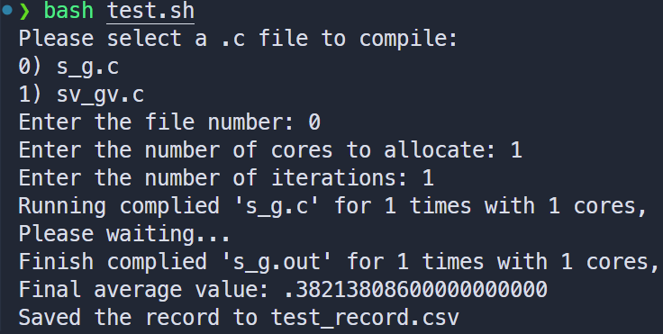

##### Test Record Table:

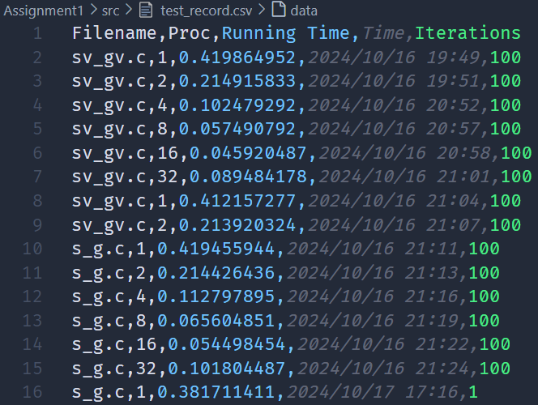

##### Chart:

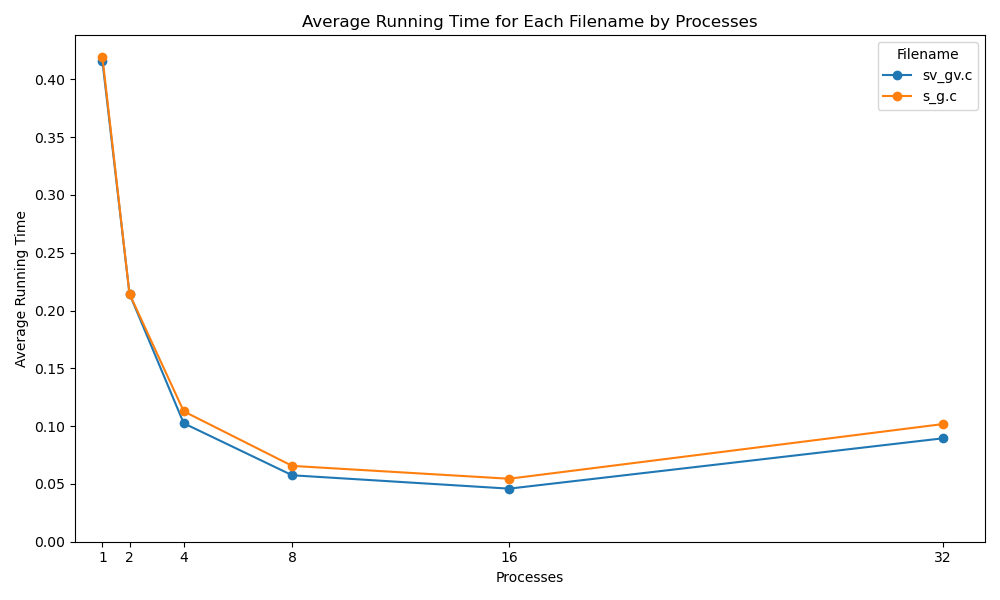

#### Feature

As the number of processes increases, the parallel computation time becomes shorter. However, once a certain number of processes is reached, the execution time reaches a minimum. Beyond that point, as more processes are added, the execution time begins to increase again.

With the growth in the number of processes, the speedup factor also increases gradually until it reaches its peak. But as the number of processes continues to rise, the speedup begins to decline.

The efficiency of the program doesn't increase as the number of processes increases.

Use `MPI_Gatherv()`,  `MPI_Gatherv()` is faster.

#### Analyze

We can see that when the number of MPI processes increases, the computing efficiency does not continue to increase, but instead decreases in the end. The reason is that in the local test environment, the CPU has 8 cores and 16 threads.

When the processes increases, we need to use the MPI `--oversubscribe` command to run multiple tasks on 1 core. At this time, the actual CPU multi-process utilization rate is not increase, so the acceleration effect is no longer obvious. (Computation gain < communication cost)

Instead, it will lead to repeated execution of more common code parts, introduce more steps to distribute tasks and collect results, and lead to a decrease in overall efficiency.

And when I use `MPI_Gatherv()`,  `MPI_Gatherv()` , the tasks are distributed more equally and the computation is more efficient (especially when the number of nodes increases and the `MAT_SIZE` cannot be simply divided by MPI processes number).

### Distributed Test

#### Screenshot

##### Docker Build:

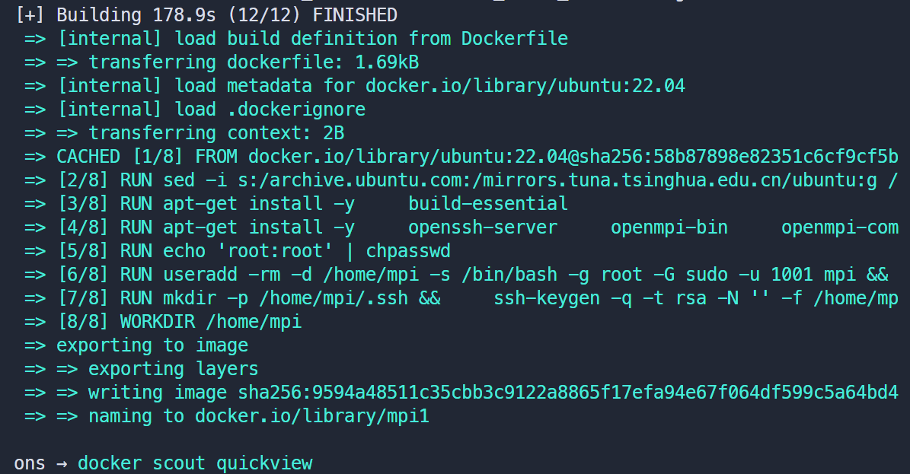

##### Run Docker Compose:

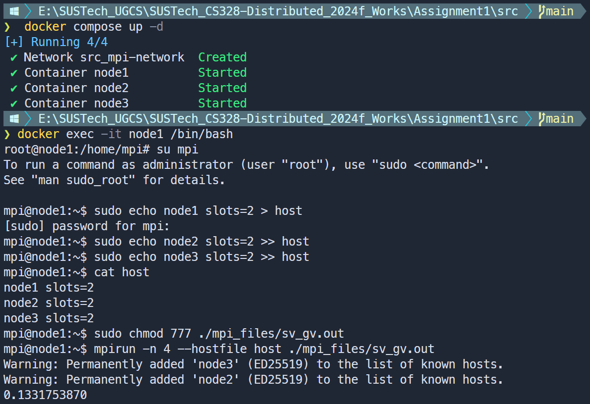

##### Distributed Running Result (only once):

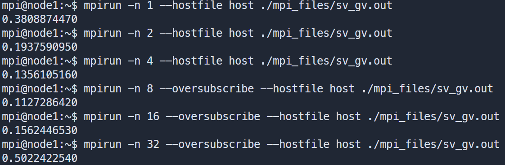

##### Compare Result Chart:

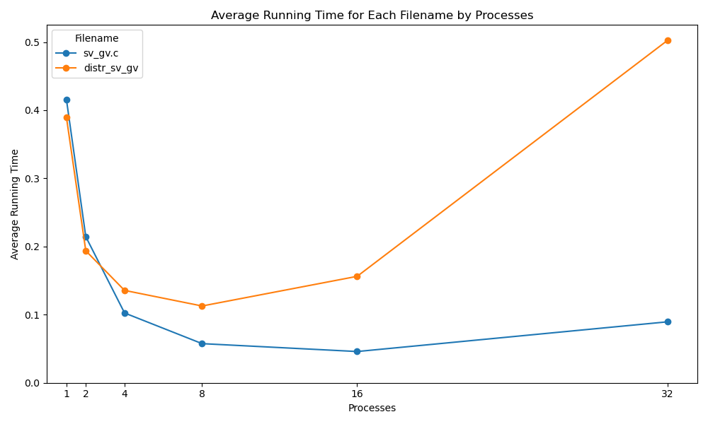

#### Images Description

I used the built `mpi1` docker image, using the docker compose configuration to created `node1`, `node2`, and `node3` 3 docker containers, and placed them in the same virtual subnet. I allocated 2 MPI slots to each node, with node1 as the host.

#### Feature & Analyze

We can see that in the distributed environment, the efficiency curves in the early stage and the local environment are similar, but as the number of MPI processes increases, the decrease in efficiency becomes very significant.

I only allocated 6 MPI slots in total. As the number of processes increases, more processes need to run on each slot. And its performance is slightly affected by docker virtualization, and its performance optimization is not as good as WSL2.

The most important thing is that in a distributed environment, the cost of communication will become relatively large. This will make the communication loss caused by the increase in processes more obvious, resulting in a significant decline in computing efficiency.

## PROBLEMS

### Memory Allocation

I first try my assignment in VMware Ubuntu 22.04 virtual machine. I allocated 2 CPUs × 4 cores and 4GB RAM for it.

Because the stack memory of `OpenMPI` slot is limited, when the number of computing nodes decreases, each node will need more stack memory to allocate its own matrix for the computing process. When the memory is insufficient, it is very easy to cause `Segmentation Fault` (my test test shows that it will happen when there are less than $12$ processes).

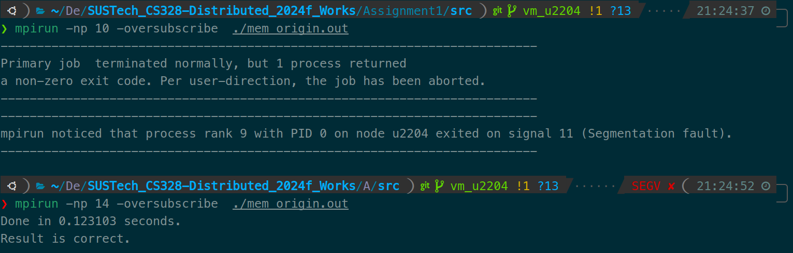

Therefore, for the matrix part, I adopted the method of dynamic memory allocation, allocating the matrix memory on the heap, and assigning the first address to a one-dimensional pointer.

```c
// double a[MAT_SIZE][MAT_SIZE],    /* matrix A to be multiplied */
// b[MAT_SIZE][MAT_SIZE],       /* matrix B to be multiplied */
// c[MAT_SIZE][MAT_SIZE],       /* result matrix C */
// bfRes[MAT_SIZE][MAT_SIZE];   /* brute force result bfRes */

double *a = (double *) malloc(MAT_SIZE * MAT_SIZE * sizeof(double));
double *b = (double *) malloc(MAT_SIZE * MAT_SIZE * sizeof(double));
double *c = (double *) malloc(MAT_SIZE * MAT_SIZE * sizeof(double));
double *bfRes = (double *) malloc(MAT_SIZE * MAT_SIZE * sizeof(double));
```
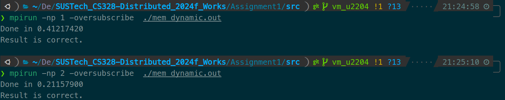

**And use WSL2 will not cause this problem.**

### Docker Build without specified Ubuntu Version

Following the steps in the lab tutorial, I wrote the `Dockerfile` to built a Docker image. When I used apt to install related file packages, network failures occurred in some file packages and the build was terminated. I simply guessed that the domestic network connection was not smooth.

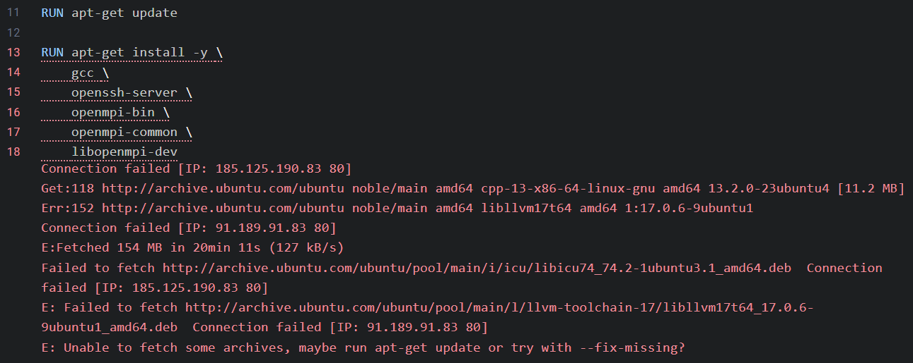

So I added a command, trying to change the source to Tsinghua University version:

```dockerfile
RUN sed -i s:/archive.ubuntu.com:/mirrors.tuna.tsinghua.edu.cn/ubuntu:g /etc/apt/sources.list && \
    sed -i s:/security.ubuntu.com:/mirrors.tuna.tsinghua.edu.cn/ubuntu:g /etc/apt/sources.list
```

But after that, the network failure still existed.

Then I check the log, and found that the The download source was not switched correctly.

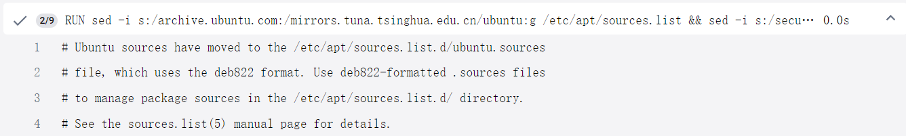

Search on the Internet: the Ubuntu has change to use more modern ways to manage the source list in 2024 fall. It use `/etc/apt/sources.list.d/` folder instead of use single `/etc/apt/sources.list` file.

So I use a new command to specify the Ubuntu version to 22.04 instead of default latest 24.04.

```dockerfile
# FROM ubuntu
FROM ubuntu:22.04
```

Then the problem has been solved.

### Nested Virtualization

I try to enable CPU in VMware to use docker in virtual machine. But there's somthing wrong.

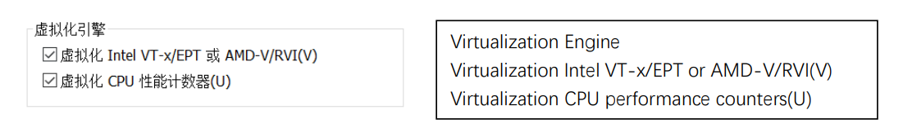

I need to enable the two options to use virtualization in virtual machine, but there's another problem:

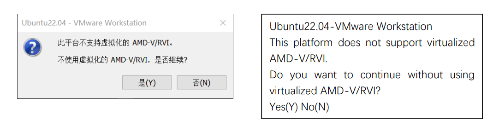

It seems that I need to configure the Windows Hyper-V service correctly and have it work with the VMware settings. But the performance loss may be much more serious. And I have already completed the experiment with WSL and Windows Docker, so I gave up trying nested virtualization.
