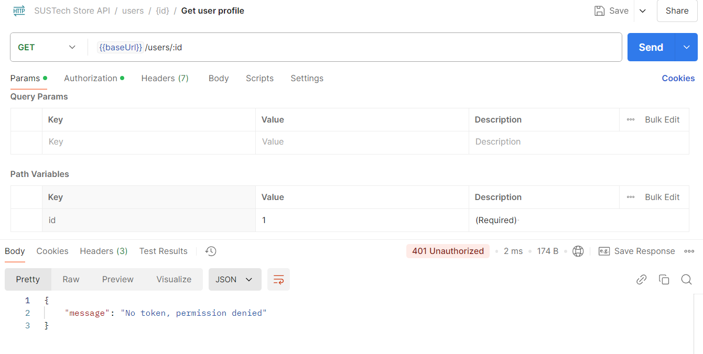

# DISTRIBUTED SYSTEMS ASSIGNMENT REPORT


**Assignment ID:** 2

**Student Name:** 徐春晖 XU Chunhui

**Student ID:** 12110304

## Brief Directory Structure

```bash
│  .env # environment setting
│  .gitignore
│  compose.yaml # Docker compose file
│  Makefile # default
│  README.md
│
├─db-init 
│      init1.sql # init databse and user
│      init2.sql # init tables and init value
│
├─golang
│  ├─api_service # Go Gin RESTful API service
│  │
│  ├─db_service # Go GORM database service
│  │
│  └─gogrpc # Go grpc common dependency
│
├─nginx # nginx config
│
├─protoc # define gRPC protocol
│
├─python
│  ├─logging_service # Python Kafka logging service
```

## Q1: What are the procedures of your implementation for each component? 

### Set Up the Environment

#### Go 3rd modules

Install Go in system follow the [official instructions](https://go.dev/doc/install). Go can manage its dependencies simply by `go.mod` file, check this file under each module to see the environment I depend on.

#### Python 3rd modules

Create a Python virtual environment with `requirements.txt`.

### Generate Code

#### API service code generation

I use the following command to generate the demo Go [Gin Web Framework](https://gin-gonic.com/) code:

```
docker run --rm \
    -v ./:/app/ openapitools/openapi-generator-cli generate \
    -i /app/sustechstore.yaml \
    -g go-gin-server \
    -o /app/api_service/
```

 I replace the former generator `python-flask` to `go-gin-server` , then I got the original Gin demo by the generator.

Based on the generated code, I restructured the directory and modularized the functions to make the code clearer and easier to read.

#### gRPC code generation

I define the gRPC by using `dbs.proto` , `glog.proto`  for db gRPC, log gRPC respectively. And I use command

```makefile
# protoc/Makefile

db_out_dir=../golang/gogrpc
db_proto_files=dbs.proto

gen-db:
	protoc -I=./ --go_out=${db_out_dir} --go-grpc_out=${db_out_dir} ${db_proto_files}


log_go_dir=../golang/gogrpc
log_py_dir=../python/logging_service
log_proto_files=glog.proto


gen-go-log:
	protoc -I=./ --go_out=${log_go_dir} --go-grpc_out=${log_go_dir} ${log_proto_files}

gen-py-log: py-log-clean
	python -m grpc_tools.protoc -I=./ --python_out=${log_py_dir} --grpc_python_out=${log_py_dir} ${log_proto_files}
```

to generate gRPC protobuf code in specific languages (Go and Python), and the corresponding service can use these functions in generated codes. 

### Implement the Business Logic

#### api handle function example

```go
// codebase/golang/api_service/api/v1/api_products.go

// GetProduct handles GET /products/:id endpoint to retrieve product details by ID
func (api *ProductsAPI) GetProduct(c *gin.Context) {
	// Parse and validate product ID from URL parameter
	productID, err := strconv.Atoi(c.Param("id"))
	if err != nil {
		utils.SendBadRequestErr(c, "Invalid product ID")
		return
	}

	// Prepare database gRPC request
	req := &dbpb.GetProductRequest{
		ProductId: int32(productID),
	}

	// Get gPRC response information from database service
	res, err := dbclient.GetDbClient().GetProduct(c.Request.Context(), req)

	// Handle database errors
	if err != nil {
		utils.SendDbErr(c, err.Error())
		return
	}

	// Handle case when product is not found
	if res == nil {
		utils.SendNotFoundErr(c)
		return
	}

	// Convert database response to API response model
	product := models.Product{
		Id:          res.Id,
		Name:        res.Name,
		Description: res.Description,
		Category:    res.Category,
		Price:       res.Price,
		Slogan:      res.Slogan,
		Stock:       res.Stock,
		CreatedAt:   res.CreatedAt,
	}

	// Send logging gRPC message
	utils.ResponseLog(c, http.StatusOK, "Get product success")

	//Return successful response to RESTful client
	c.JSON(http.StatusOK, product)
}

```

#### db database option example

```go
// codebase/golang/db_service/service/products.go

// GetProduct retrieves a product from the database by ID
func (s *DatabaseService) GetProduct(ctx context.Context, req *dbpb.GetProductRequest) (*dbpb.Product, error) {
    // Query the product from database using GORM
    var product models.Product
    if err := s.db.First(&product, req.ProductId).Error; err != nil {
        // Return gRPC error if product not found
        return nil, status.Errorf(codes.NotFound, "Product not found")
    }

    // Convert database model to protobuf response and send to api service
    return &dbpb.Product{
        Id:          product.ID,
        Name:        product.Name,
        Description: product.Description,
        Category:    product.Category,
        Price:       product.Price,
        Slogan:      product.Slogan,
        Stock:       product.Stock,
        CreatedAt:   product.CreatedAt.String(),
    }, nil
}
```

#### logging example

Omitted, refer to Q5: For your Logging Service, explain how the server-side streaming RPC works.

## Q2: For your API Service, which APIs require authentication? How do you implement the authentication logic?

### APIs Need Authentication

#### User

- Deactivate
- Get User Info
- Update User

#### Order

- Place Order
- Get Order
- Cancel Order

### Generate Token

```go
func GenerateToken[T ~int | ~int32](userId T) (string, error) {
	// use user Id, generate a 24-hour token
	claims := jwt.MapClaims{
		"user_id": userId,
		"exp":     time.Now().Add(time.Hour * 24).Unix(),
	}

	token := jwt.NewWithClaims(jwt.SigningMethodHS256, claims)
	return token.SignedString(secretKey)
}

func ParseToken(tokenString string) (int, error) {
	token, err := jwt.ParseWithClaims(tokenString, jwt.MapClaims{}, func(token *jwt.Token) (interface{}, error) {
		// Check the signing method
		if _, ok := token.Method.(*jwt.SigningMethodHMAC); !ok {
			return nil, jwt.ErrSignatureInvalid
		}
		return secretKey, nil
	})

	if err != nil {
		return 0, err
	}

	// From the token get the user id
	if claims, ok := token.Claims.(jwt.MapClaims); ok && token.Valid {
		userId := int(claims["user_id"].(float64))
		return userId, nil
	}

	return 0, jwt.ErrSignatureInvalid
}
```

### Authentication Logic

In Login method, I return a token to user:

```go
// codebase/golang/api_service/api/v1/api_users.go

// LoginUser Post /users/login
func (api *UsersAPI) LoginUser(c *gin.Context) {
	// password verification
    
    // ...
    
    // use User Id to generate token
	token, err := utils.GenerateToken(uint(user.Id))
	if err != nil {
		utils.SendInternalErr(c, "Failed to generate token")
		return
	}

	utils.ResponseLog(c, http.StatusOK, "Login successful")
	c.JSON(http.StatusOK, gin.H{
		"token": token,
	})
}
```


I use a Gin middleware to enable JWT in APIs need authentication:

```go
// codebase/golang/api_service/middleware/auth.go

// JWTAuth is a Gin middleware function that handles JWT authentication
func JWTAuth() gin.HandlerFunc {
   return func(c *gin.Context) {
       // Get the Authorization header from the request
       token := c.GetHeader("Authorization") 
       
       // Check if token exists
       if token == "" {
           // Return 401 if no token provided
           c.JSON(http.StatusUnauthorized, models.Message{
               Message: "No token, permission denied",
           })
           c.Abort()
           return
       }

       // Remove "Bearer " prefix from token
       token = strings.TrimPrefix(token, "Bearer ")

       // Parse and validate the token, extract user ID
       userId, err := utils.ParseToken(token)
       if err != nil {
           // Return 401 if token is invalid
           c.JSON(http.StatusUnauthorized, models.Message{
               Message: "Invalid token, permission denied", 
           })
           c.Abort()
           return
       }

       // Store user ID in context as "token_user_id" for later use
       c.Set("token_user_id", userId)
       
       // Continue to next middleware/handler
       c.Next()
   }
}
```

Then, in specific API, compare and verify the `token_user_id` with the `user_id`  related to the information to be operated:

```go
// codebase/golang/api_service/api/v1/api_users.go

// DeactivateUser Delete /users/:id
func (api *UsersAPI) DeactivateUser(c *gin.Context) {
	userID, err := strconv.Atoi(c.Param("id"))
	if err != nil {
		utils.SendBadRequestErr(c, "Invalid user ID")
		return
	}

	tokenId, exists := c.Get("token_user_id")
	if !(exists && userID == tokenId) {
		// token_user_id != request related user_id
		utils.SendUnauthorizedErr(c)
		return
	}

	// ...
}
```

## Q3: How do you select field data types for different definitions?

**I give the example by model `Product`, it contains almost all the types.**

#### Database Table

```sql
CREATE TABLE products (
  id SERIAL PRIMARY KEY,
  name VARCHAR(100) NOT NULL,
  description TEXT,
  category VARCHAR(50),
  price DECIMAL(10, 2) NOT NULL,
  slogan VARCHAR(255),
  stock INT NOT NULL DEFAULT 500,
  created_at TIMESTAMP DEFAULT NOW()
);
```

#### Database ORM Model

```go
type Product struct {
	ID          int32     `gorm:"primaryKey"`
	Name        string    `gorm:"size:100;not null"`
	Description string    `gorm:"type:text"`
	Category    string    `gorm:"size:50"`
	Price       float64   `gorm:"type:decimal(10,2);not null"`
	Slogan      string    `gorm:"size:255"`
	Stock       int32     `gorm:"not null;default:500"`
	CreatedAt   time.Time `gorm:"default:CURRENT_TIMESTAMP"`
}
```

#### Protobuf Model

```protobuf
message Product {
  int32 id = 1;
  string name = 2;
  string description = 3;
  string category = 4;
  double price = 5;
  string slogan = 6;
  int32 stock = 7;
  string created_at = 8;
}
```

#### RESTful API Model

```go
type Product struct {
	Id int32 `json:"id,omitempty"`

	Name string `json:"name,omitempty"`

	Description string `json:"description,omitempty"`

	Category string `json:"category,omitempty"`

	Price float64 `json:"price,omitempty"`

	Slogan string `json:"slogan,omitempty"`

	Stock int32 `json:"stock,omitempty"`

	CreatedAt string `json:"created_at,omitempty"`
}
```

#### Analysis

We can see that, for these type in SQL: to ORM (Go) to Protobuf to RESTful API (Go)

- `INT` : to `int32` to `int32` to `int32`
- `VARCHAR` : to `string` to `string` to `string`
- `TEXT` : to `string` to `string` to `string`
- `DECIMAL` : to `float64` to `double` to `float64`
- `TIMESTAMP` : to `time` to `string` to `string`

For:

- `INT` , its best to use 32 bit integer to define it
- `VARCHAR` / `TEXT` : its best to use string to define it
- `DECIMAL` : It is safer to use double-precision floating point numbers uniformly
- `TIMESTAMP` : Only avaliable when GET data from database item, so set it as `string` when leave database.

## Q4: For gRPC-based services, select an arbitrary Proto message from your definition, and analyze how it is encoded into binary format. Use Protobuf to programmatically verify the encoding result.

### Message selection

I referred to the code modification of Lab 6 and selected my `LogMessage` as the test model.

### Defination

```protobuf
// codebase/protoc/glog.proto

enum LogLevel{
    // ...
}

message LogMessage {
  LogLevel level = 1;
  string service_name = 2;
  string message = 3;
  int64 timestamp = 4;
  string trace_id = 5;
}
```

### Test

```python
# codebase/python/logging_service/test_protobuf.py
def serialize_and_deserialize()
    init_msg = glog_pb2.LogMessage(
        level=glog_pb2.INFO,
        service_name='encode test',
        message='test message',
        timestamp=11187097077,
        trace_id='default',
    )
    # ...

def compare_with_json():
    # JSON serialization
    json_req = {
        'level': glog_pb2.INFO,
        'service_name': 'encode test',
        'message': 'test message',
        'timestamp': 11187097077,
        'trace_id': 'default',
    }
    
    # ...
```

### Result


### Analysis

Check the Internet and the comment of Lab 6 code, I foound:

Each message consists of multiple fields, each field consists of three parts:

- Tag: consists of field number and wire type
- Length: For variable length types (such as strings), the length needs to be specified
- Value: The actual data

Tag encoding:

- The calculation formula for Tag is: (field_number << 3) | wire_type
- field_number: field number (defined in the .proto file)
- wire_type: encoding type (0=varint, 1=I64, 2=LEN, 5=I32)
    - VARINT: int32, int64, uint32, uint64, sint32, sint64, bool, enum
    - I64: fixed64, sfixed64, double
    - LEN: string, bytes, embedded messages, packed repeated fields
    - I32: fixed32, sfixed32, float

We can see that Protobuf's encoding is more compact than JSON's encoding.

Protobuf serializes object information into a compact binary data stream and transmits information in a very efficient way.

With the same information content, its transmission volume is much smaller than JSON.

## Q5: For your Logging Service, explain how the server-side streaming RPC works.

In the proto file, the StreamLogs RPC method is defined as:

```protobuf
// protooc/glog.proto

message LogMessage {
  LogLevel level = 1;
  string service_name = 2;
  string message = 3;
  int64 timestamp = 4;
  string trace_id = 5;
}

message LogResponse {
  bool success = 1;
  string message = 2;
}

service LoggingService {
  rpc StreamLogs(stream LogMessage) returns (LogResponse);
}
```

(On the client side, I did not introduce uuid to implement the trace id function, but set it as default).

In server-side,

```python
# codebase/python/logging_service/local_publisher.py

class LoggingService(glog_pb2_grpc.LoggingServiceServicer):
    def __init__(self, kafka_config):
        self.producer = Producer(kafka_config)
        self.topic = "log-channel" # kafka t

    def publish_to_kafka(self, log_message):
        try:
            message_dict = {
                'level': glog_pb2.LogLevel.Name(log_message.level),
                'service_name': log_message.service_name,
                'message': log_message.message,
                'timestamp': log_message.timestamp,
                'trace_id': log_message.trace_id
            }

            print(json.dumps(message_dict))
            self.producer.produce(
                self.topic,
                value=json.dumps(message_dict).encode('utf-8'),
            )
            self.producer.poll(0)

        except Exception as e:
            print(f"Error publishing to Kafka: {str(e)}")
            return False
        return True

    def delivery_report(self, err, msg):
        if err is not None:
            print(f'Message delivery failed: {err}')
        else:
            print(f'Message delivered to {msg.topic()} [{msg.partition()}]')

    def StreamLogs(self, request_iterator, context):
        try:
            # Iterate through each log message sent by the client
            for log_message in request_iterator:
                # Publish each log to Kafka
                success = self.publish_to_kafka(log_message)

                # If publishing fails, return error response immediately
                if not success:
                    return glog_pb2.LogResponse(
                        success=False,
                        message="Failed to publish logs to Kafka"
                    )

            # After processing all messages, ensure they are sent to Kafka
            self.producer.flush()

            # Return success response
            return glog_pb2.LogResponse(
                success=True,
                message="Successfully processed all logs"
            )

        except Exception as e:
            context.set_code(grpc.StatusCode.INTERNAL)
            context.set_details(f'An error occurred: {str(e)}')
            return glog_pb2.LogResponse(
                success=False,
                message=f"Error processing logs: {str(e)}"
            )

```

The server receives these messages stream through the `request_iterator`

For each received log message, the server:

- Converts gRPC messgae to JSON format within the function `publish_to_kafka()`
- Publishes it to the specified Kafka topic

## Q6: How do you configure Docker and Docker Compose so that these services can communicate with one another?

### Docker

I used separate `Dockerfile` for each of the three modules to create different docker images.

#### api Docker

```dockerfile
# codebase/golang/api_service/Dockerfile

# Use golang as the build image
FROM golang:1.23.3 AS build

WORKDIR /go/src

# Copy source code
COPY api_service/ ./api_service
# Also copy gRPC module
COPY gogrpc/ ./gogrpc

# Disable CGO for static pure Go binary
ENV CGO_ENABLED=0

WORKDIR /go/src/api_service

# Build the application binary
RUN go build -o /go/openapi ./cmd/main.go

# Start a new stage with minimal scratch image
FROM scratch AS runtime

# Set Gin framework to release mode
ENV GIN_MODE=release

# Copy binary from build stage
COPY --from=build /go/openapi /openapi

# Expose API port
EXPOSE 8080

# Set the entry point
ENTRYPOINT ["/openapi"]
```

#### db Docker

```dockerfile
# codebase/golang/db_service/Dockerfile

# Similar to api_service Dockerfile

FROM golang:1.23.3 AS build

WORKDIR /go/src

COPY db_service/ ./db_service
COPY gogrpc/ ./gogrpc

ENV CGO_ENABLED=0

WORKDIR /go/src/db_service

RUN go build -o /go/db_service ./cmd/main.go


FROM scratch AS runtime

COPY --from=build /go/db_service /db_service

EXPOSE 50051

CMD ["/db_service"]

```

#### logging Docker

```dockerfile
# codebase/python/logging_service/Dockerfile

# Use Python 3.11 as the base image
FROM python:3.11

WORKDIR /app

# Copy all files from current directory to container
COPY . .

# Install Python dependencies without caching pip packages
RUN pip install --no-cache-dir -r requirements.txt

# Expose port for the service
EXPOSE 50052

# Start the logging service script
CMD ["python", "local_publisher.py"]
```

### Docker Compose

New services I added:

```yaml
# codebase/compose.yaml

services:
  # Prevoise services in demo
  # ...
  
  # Logging Service
  logging_service:
    build:
      context: ./python/logging_service
      dockerfile: Dockerfile
    container_name: logging_service
    depends_on:
      - kafka
    environment:
      KAFKA_BROKER: kafka:9092
    ports:
      - "50052:50052"

  # DB Service
  db_service:
    build:
      context: ./golang
      dockerfile: db_service/Dockerfile
    container_name: db_service
    depends_on:
      - postgres
    environment:
      POSTGRES_HOST: postgres
      POSTGRES_PORT: ${POSTGRES_PORT}
      POSTGRES_USER: ${POSTGRES_USER}
      POSTGRES_PASSWORD: ${POSTGRES_PASSWORD}
      POSTGRES_DB: ${POSTGRES_DB}
    ports:
      - "50051:50051"

  api_service_build:
    build:
      context: ./golang
      dockerfile: api_service/Dockerfile
    image: api_service_image

  # API Service 1
  api_service_1:
    image: api_service_image
    container_name: "api_service_1"
    depends_on:
      - db_service
      - logging_service
    environment:
      SERVICE_NAME: "api server 1"
      API_HOST: "0.0.0.0"
      API_PORT: 5000
      DB_SERVICE_HOST: db_service
      DB_SERVICE_PORT: 50051
      LOGGING_SERVICE_HOST: logging_service
      LOGGING_SERVICE_PORT: 50052

  # API Service 2
  api_service_2:
    image: api_service_image
    container_name: "api_service_2"
    depends_on:
      - db_service
      - logging_service
    environment:
      SERVICE_NAME: "api server 2"
      API_HOST: "0.0.0.0"
      API_PORT: 5000
      DB_SERVICE_HOST: db_service
      DB_SERVICE_PORT: 50051
      LOGGING_SERVICE_HOST: logging_service
      LOGGING_SERVICE_PORT: 50052

  nginx:
    image: nginx:1.24.0
    container_name: nginx
    volumes:
      - ./nginx/nginx.conf:/etc/nginx/nginx.conf:ro
    ports:
      - "80:80"
    depends_on:
      - api_service_1
      - api_service_2
```

In the `compose.yaml` file, I defined the context and Dockerfile required for each service when building, so that different Docker Images can be created for subsequent use.
I also defined the corresponding environment variables for each service, including the corresponding service host and port. In this way, the containers of different services can communicate under a Compose network.
It is worth noting that I run two containers for the image created for the api service, that is, there are two api services, which is used to demonstrate the feasibility of my [Nginx](http://nginx.org) load balancing implementation.

## Q7: How do you run the experiment? Which tool (i.e., cURL, Postman, Swagger UI) do you use to test your API Service? How do you monitor the log messages from the Kafka topic?

### Run

I defined the individual services using a docker compose file, so I can run these command

```bash
 docker compose --profile build-only build # pre-build the api_service_image 
 
 docker compose -f compose.yaml -p codebase up -d
```

to start my Docker Compose micro services network, here's the result by Docker desktop GUI application:


We can see that all the services runs and communicate with each other normally.

### Tool to Test

I use [Postman](https://www.postman.com) GUI to test my RESTful API service. Here are the results.

#### Greetting


#### Products


#### Register


#### Login

##### Wrong Password


##### Success


#### Get User Information

##### Without Token (An example for ALL auth options)



##### With token


##### Update User Info

##### Option (Email as an changeable example)


##### Result


#### Place Order


And another order placed, then

#### Check own Order

##### Option


##### Stock Result


#### Cancel Order

##### Option


##### Result


#### Deativate

##### Create a new user and Login


##### Deactivate other user (use new user token, an example for ALL auth options)


##### Deactivate self


##### Result (No user)


### Monitor Log Message

I monitor the logs by a python script in project root / testcode, as below:

```python
# testcode/consumer.py

def save_log_to_file(log_data):
    # Create logs directory if not exists
    log_dir = "logs"
    if not os.path.exists(log_dir):
        os.makedirs(log_dir)

    # Generate filename with current date (format: YYYYMMDD_HH)
    filename = os.path.join(log_dir, f"log_{datetime.now().strftime('%Y%m%d_%h')}.txt")

    # Append log entry with timestamp to file
    with open(filename, 'a', encoding='utf-8') as f:
        f.write(f"{datetime.now().isoformat()}: {json.dumps(log_data, ensure_ascii=False)}\n")


def main():
    # Kafka consumer configuration
    config = {
        'bootstrap.servers': 'localhost:9093',
        'group.id': 'log-consumer-group',
        'auto.offset.reset': 'earliest'
    }

    # Initialize Kafka consumer and subscribe to log channel
    consumer = Consumer(config)
    consumer.subscribe(['log-channel'])

    try:
        while True:
            # Poll for messages with 1 second timeout
            msg = consumer.poll(1.0)
            if msg is None:
                continue
            if msg.error():
                print(f"Consumer error: {msg.error()}")
                continue

            try:
                # Parse and save received log message
                log_data = json.loads(msg.value().decode('utf-8'))
                save_log_to_file(log_data)
                print(f"Received log: {log_data}")
            except Exception as e:
                print(f"Error processing message: {e}")

    except KeyboardInterrupt:
        pass
    finally:
        # Ensure proper cleanup of consumer
        consumer.close()

```

I monitor the logs in port 9093 or 19093, get the stream messages and save it to the logs for each hours.


## Bonus Part

### Cross-Language gRPC

For api servicec as gRPC client,  logging service as gRPC server, I use Go to implement api part and Python to implement logging part. This is a cross-language gRPC implementation.

### Load-Balancing

I ran two separate services for the Docker Image of the api service, and then used the Nginx engine for load balancing, as shown in the previous report (Docker / Docker Compose / logging test).
I used the simplest round-robin load without implementing complex Nginx settings and tests, aiming to prove that I can indeed introduce Nginx load balancing and it works properly.

nginx.config:

```nginx
# codebase/nginx/nginx.conf

events {}

# handle HTTP requests
http {
  # define a group of backend servers that will handle requests
  upstream gin_servers {
    # Default load balancing method is round-robin.
    server api_service_1:5000;
    server api_service_2:5000;
  }

  # virtual server config
  server {
    listen 80;

    # process requests matching the URI pattern (`/` means root + everything under it)
    location / {
      proxy_pass http://gin_servers;
            
      proxy_set_header Host $host;
      proxy_set_header X-Real-IP $remote_addr;
      proxy_set_header X-Forwarded-For $proxy_add_x_forwarded_for;
      proxy_set_header X-Forwarded-Proto $scheme;
    }
  }
}
```

------

**This report ends here**
