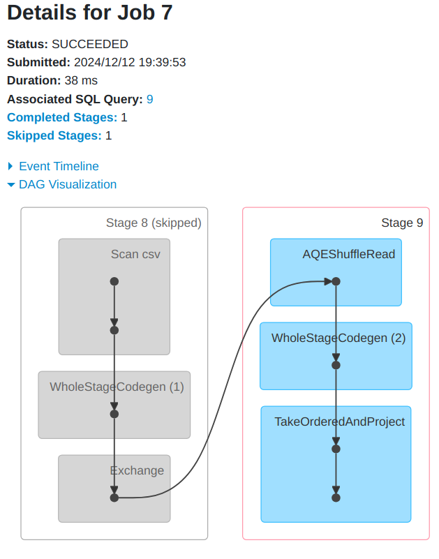
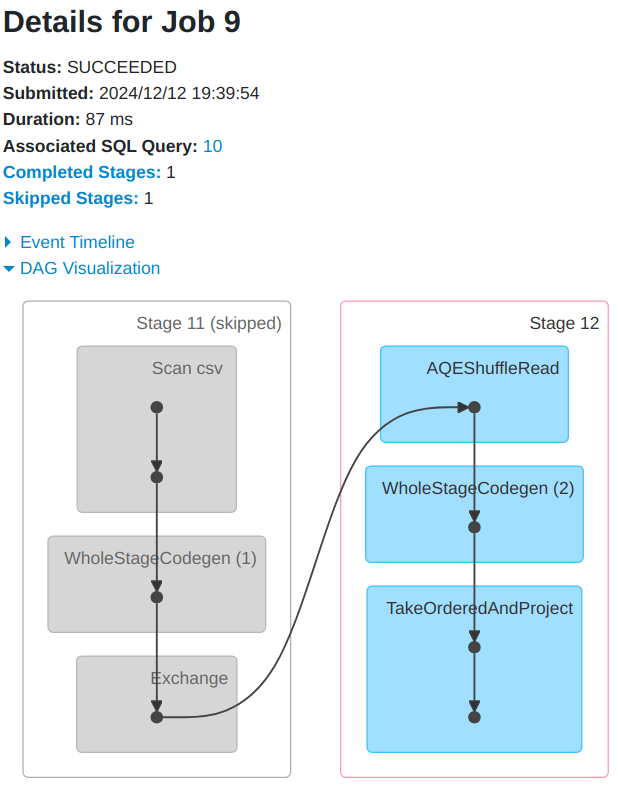
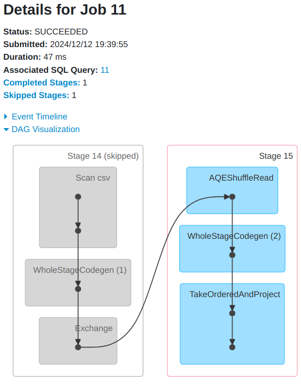
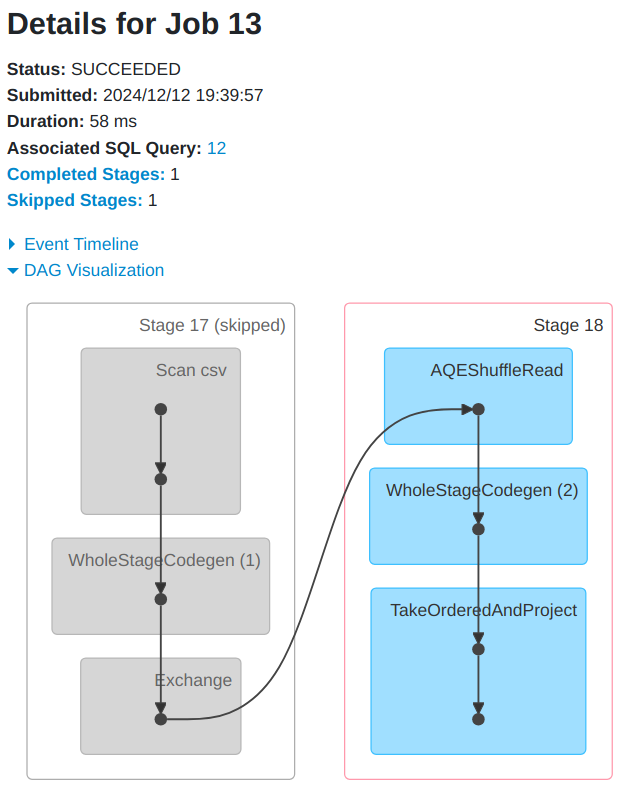
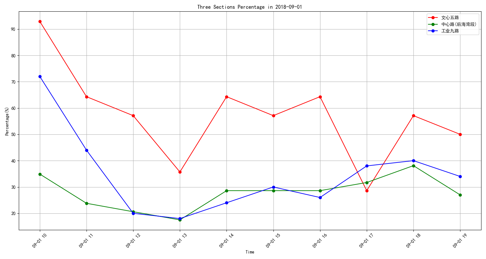

# DISTRIBUTED SYSTEMS ASSIGNMENT REPORT


**Assignment ID:** 3

**Student Name:** 徐春晖 XU Chunhui

**Student ID:** 12110304

## DESIGN

### Structure

```bash
├─code
│      parking_analysis.ipynb # main analysis notebook
│      plot.py # plot functions
│      requirements.txt
│
├─data
│      .gitkeep
│      parking_data_sz.csv # origin data (may absent in submision)
│      parking_utilization.png # r5 subtask picture
│      r1.csv
│      r2.csv
│      r3.csv
│      r4.csv
│      r5.csv
```


I will use code and necessary comments to describe this part

### Data Clean

```python
    def __init__(self):
        self.sc: SparkContext
        self.spark: SparkSession
        self.df: DataFrame
        self.__tasks: tuple[DataFrame, DataFrame,
                            DataFrame, DataFrame, DataFrame]
        self.__init_data()

    def __init_data(self):
        """Initialize the data and create the dataframe"""

        # Create a Spark context
        sc = SparkContext.getOrCreate()

        # Create a Spark session
        spark = SparkSession \
            .builder \
            .appName("Parking Data Analysis") \
            .getOrCreate()

        # Load data from csv file
        df = spark.read.csv(
            path=ParkingDb.__get_data_file_path("parking_data_sz.csv"),
            header=True,
            schema=ParkingDb.schema
        )

        # filter out invalid data by checking out_time > in_time
        cleaned_data = df.filter(
            f.col("out_time") > f.col("in_time"))

        # calculate parking time length and drop out_time column
        df_convert_out = cleaned_data.withColumn(
            "parking_time_length",
            f.unix_timestamp("out_time") - f.unix_timestamp("in_time")
        ).drop("out_time")

        # cache the final dataframe
        # df_convert_out = df_convert_out.cache()
        df_final = df_convert_out

        # assign to instance variables
        self.sc = sc
        self.spark = spark
        self.df = df_final
        self.__tasks = self.__execute()
```

### Task implementation logic

#### Task 1

```python
    def __task1(self) -> DataFrame:
        return self.df.groupBy("section") \
            .agg(f.countDistinct("berthage").alias("count")) \
            # .orderBy("section")
```

#### Task 2

```python
    def __task2(self) -> DataFrame:
        return self.df.select("berthage", "section").distinct() \
            # .orderBy("section", "berthage")
```

#### Task 3

```python
    def __task3(self) -> DataFrame:
        return self.df.groupBy("section") \
            .agg(f.avg("parking_time_length").cast("integer").alias("avg_parking_time")) \
            # .orderBy("section")
```

#### Task 4

```python
    def __task4(self) -> DataFrame:
        return self.df.groupBy("berthage") \
            .agg(f.avg("parking_time_length").cast("integer").alias("avg_parking_time")) \
            .orderBy(f.col("avg_parking_time").desc())
```

#### Task 5

```python
    def __task5(self) -> DataFrame:
        # create a new dataframe with hourly time range
        df_hours = self.df.withColumn(
            "start_time",
            f.date_trunc("hour", f.col("in_time"))
        ).withColumn(
            "end_time",
            f.date_trunc("hour", f.col("in_time")) + f.expr("INTERVAL 1 HOUR")
        )

        # calculate total berthages for each section
        total_berthages = self.df.select("section", "berthage").distinct() \
            .groupBy("section").count().withColumnRenamed("count", "total_berthages")

        # calculate hourly usage for each section
        hourly_usage = df_hours.groupBy("start_time", "end_time", "section") \
            .agg(f.countDistinct("berthage").alias("count"))

        # join the two dataframes and calculate the percentage
        result: DataFrame = hourly_usage.join(total_berthages, "section") \
            .withColumn(
            "percentage",
            f.format_number(f.col("count") / f.col("total_berthages") * 100, 1)
        ).select("start_time", "end_time", "section", "count", "percentage") \
            # .orderBy("section", "start_time")

        return result
```


## RUNNING RESULT

### Result Show

Could be found in notebook's output and `.csv` files.

### Spark job’s DAG

#### Task 1


#### Task 2



#### Task 3



#### Task 4



#### Task 5




#### r5 Subtask Analysis



I selected three sections and analyzed and visualized them hourly on 2018-09-01.

I found that parking occupancy rates were higher in the morning and evening, probably because people had not started their day yet, so the cars were in the parking lot.

During the day, people would drive around, so parking occupancy rates were lower.
