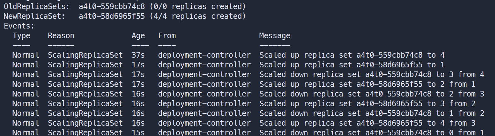

# DISTRIBUTED SYSTEMS ASSIGNMENT REPORT


**Assignment ID:** 4

**Student Name:** 徐春晖 XU Chunhui

**Student ID:** 12110304

Task 0: K8s Deployment & Service

## Structure

```bash
├─codebase
│  ├─flask_app # app
│  │  │  Makefile
│  │  │  README.md
│  │  │  Dockerfile # Dockerfile
│  │  │  requirements.txt # pip requirement
│  │  │
│  │  ├─v1.0.0 # old api version (without /chat)
│  │  │      app.py
│  │  │
│  │  └─v1.0.1 # new api version (have /chat)
│  │          app.py
│  │
│  ├─t0 # task 0
│  │      kind-config.yaml
│  │      Makefile # commands
│  │      t0.yaml
│  │
│  └─t1 # task 1
│          kind-config.yaml
│          Makefile # commands
│          t1-new.yaml # without class=vip tolerantion
│          t1-old.yaml # with class=vip tolerantion
```


## Build Image

### Instructions

```makefile
# codebase/flask_app/Makefile

.PHONY: build-old build-new build-all

OLD_VERSION:=1.0.0
NEW_VERSION:=1.0.1

build-old:
	docker build --build-arg VERSION=$(OLD_VERSION) -t a4-flask:$(OLD_VERSION) .

build-new:
	docker build --build-arg VERSION=$(NEW_VERSION) -t a4-flask:$(NEW_VERSION) .

build-all: build-old build-new
```

### Screenshot


## Task 0: K8s Deployment & Service

### Instructions

I use these necessary command in task 0.

Actually, I'm using the original commands in the screenshot so that it's easier to tell.

```makefile
# codebase/t0/Makefile

.PHONY: create-cluster delete-cluster apply-config update-image show-pods

CLUSTER_NAME := a4t0
DEPLOYMENT_NAME := a4t0
DEPLOYMENT_SERVICE := a4t0-service
OLD_IMAGE := a4-flask:1.0.0
NEW_IMAGE := a4-flask:1.0.1
K8S_CONFIG_FILE := t0.yaml

# Create a new cluster and load the images
create-cluster:
	kind create cluster --name $(CLUSTER_NAME) --config kind-config.yaml
	kind load docker-image $(OLD_IMAGE) --name $(CLUSTER_NAME)
	kind load docker-image $(NEW_IMAGE) --name $(CLUSTER_NAME)

# Delete the cluster
delete-cluster:
	kind delete cluster --name $(CLUSTER_NAME)

apply-config:
	kubectl apply -f $(K8S_CONFIG_FILE)
	kubectl set image deployment/$(DEPLOYMENT_NAME) flask-containers=$(OLD_IMAGE)

# Update the deployment with the new image
update-image:
	kubectl set image deployment/$(DEPLOYMENT_NAME) flask-containers=$(NEW_IMAGE)
	kubectl describe deployment $(DEPLOYMENT_NAME)

# Show the pods status
show-pods:
	kubectl get pods -o wide
```

#### Cluster Configuration

```yaml
# codebase/t0/kind-config.yaml

kind: Cluster
apiVersion: kind.x-k8s.io/v1alpha4
nodes:
  - role: control-plane
  - role: worker
  - role: worker
  - role: worker
```

### Result and Screenshot

#### Build cluster


#### v1.0.0 Test and Result


From first two commands, we can see the service in different node is running correctly. And we can see pod IP and node name from the `/` API response.

We can see that the access of `/chat` API will cause 404 error. The Flask controller will return a piece of 404 HTML code, indicated that this path is unavailable.

#### Load Image v1.0.1


We use new image, roll out and perform `/chat` API, its function is normal.

#### Rollout Events



```yaml
# codebase/t0/t0.yaml
  
  strategy:
    rollingUpdate:
      maxSurge: 1
      maxUnavailable: 1
    type: RollingUpdate
```


- `maxUnavailable: 1`: At most one pod can be unavailable during the update
- `maxSurge: 1`: At most one extra pod can be created during the update

And we can see that the new replica set plus 1 with the old replica set minus 1. Finally, all the 4 replicas becomes new. 

This is my rollout strategy result.

#### Delete Pod

I ran the following command:

```bash
kubectl delete pod a4t0-559cbb74c8-2zt2x
```

Then I got:


From the screenshots, we can see that: the old pod is completed and a new one becomes running.

If a pod dies, K8s will automatically create a new pod.

It  will always keep the number of running pods equal to the value specified by replicas

## Task 1: K8s Pod Scheduling

### Instructions

I use these necessary command in task 1.

Actually, I'm using the original commands in the screenshot so that it's easier to tell.

```makefile
# codebase/t1/Makefile

.PHONY: create-cluster delete-cluster list-node-labels list-node-taints apply-old apply-new
.PHONY: show-pods show-describe scale scale-1 scale-2 scale-3 scale-4 scale-5 show-pods

CLUSTER_NAME := a4t1
DEPLOYMENT_NAME := a4t1-deployment
K8S_CONFIG_FILE_OLD := t1-old.yaml
K8S_CONFIG_FILE_NEW := t1-new.yaml

create-cluster:
	kind create cluster --name $(CLUSTER_NAME) --config kind-config.yaml

delete-cluster:
	kind delete cluster --name $(CLUSTER_NAME)

list-node-labels:
	# kubectl get nodes --show-labels
	kubectl get nodes -o jsonpath='{range .items[*]}{.metadata.name}{"\t"}{.metadata.labels}{"\n"}{end}'

list-node-taints:
	kubectl get nodes -o jsonpath='{range .items[*]}{.metadata.name}{"\t"}{.spec.taints}{"\n"}{end}'

apply-old:
	kubectl apply -f $(K8S_CONFIG_FILE_OLD)

apply-new:
	kubectl apply -f $(K8S_CONFIG_FILE_NEW)

show-describe:
	kubectl describe deployment $(DEPLOYMENT_NAME)

show-pods:
	kubectl get pods -o wide

scale:
	kubectl scale deployment $(DEPLOYMENT_NAME) --replicas=$(REPLICAS)

scale-1: REPLICAS=1
scale-1: scale

scale-2: REPLICAS=2
scale-2: scale

scale-3: REPLICAS=3
scale-3: scale

scale-4: REPLICAS=4
scale-4: scale

scale-5: REPLICAS=5
scale-5: scale
```

#### Cluster Configuration

```yaml
# codebase/t1/kind-config.yaml

kind: Cluster
apiVersion: kind.x-k8s.io/v1alpha4
nodes:
- role: control-plane
- role: worker
  labels:
    usage: normal
- role: worker
  labels:
    usage: normal
    capability: powerful
- role: worker
  kubeadmConfigPatches:
  - |
    kind: JoinConfiguration
    nodeRegistration:
      kubeletExtraArgs:
        # no tier label
        node-labels: "usage=normal,capability=powerful"
      taints:
      - key: class
        value: vip
        effect: NoSchedule
- role: worker
  labels:
    usage: backup
- role: worker
  labels:
    usage: backup

```

### Result and Screenshot

#### Build cluster


#### Scale without Toleration

```yaml
# codebase/t1/t1_old.yaml

    spec:
      affinity:
        podAntiAffinity:
          requiredDuringSchedulingIgnoredDuringExecution:
          - labelSelector:
              matchExpressions:
              - key: app
                operator: In
                values:
                - a4t1
            topologyKey: "kubernetes.io/hostname"
        nodeAffinity:
          preferredDuringSchedulingIgnoredDuringExecution:
          - weight: 100
            preference:
              matchExpressions:
              - key: capability
                operator: In
                values:
                - powerful
          - weight: 50
            preference:
              matchExpressions:
              - key: usage
                operator: NotIn
                values:
                - backup
```

In this file, we specify the scheduling rules

- Use `podAntiAffinity` to distribute multiple pods of the same service to different nodes to avoid single node failure.
- Use `nodeAffinity` to set the weight, let nodes with higher weights be scheduled with higher priority
    - If a node has label `capability: powerful` it will get 100 weight.
    - If a node doesn't have label `usage: backup` it will get 50 weight.
    - Overall, Worker 2, 3 have 150 weight,  Worker has 50, Worker 4, 5 has 0.


We can see that, during the scale from 0 - 5,  each Pod are in different node (due to Pod Anti-Affinity).

And from the `AGE` , we can see the order in which Pods are created in a Node is:

- Worker 2 -> 1 -> 4 -> 5 -> 3(unavailable). 

This is consistent with our preset functional weights. The taint label of Worker 3 works normally.


Due to taint label, replica of Node Worker 3 is unavailable. 

#### Scale with Toleration

Modify K8s configuration in `t1_new.yaml` , tolerant taints `class=vip`

```yaml
# codebase/t1/t1_new.yaml

      tolerations:
      - key: "class"
        operator: "Equal"
        value: "vip"
        effect: "NoSchedule"
```


When we tolerant taint with `class=vip` , we can use Node Worker 3 normally. And Its capability is `powerful`, so the scheduling order is: 

- Worker 2 -> 3 -> 1 -> 4 -> 5.


All the 5 replicas is avaliable.

#### API Test


The function is normal.

## Problems

### Image pull problem

In task 1, I specify the container's image instead of manually load it into pods.

When I specify the image as local `a4-flask:1.0.1` in `t1.yaml` , an `ErrImagePull` error will occur. And the pod will not working correctly.


The reason is that Docker will first look for the corresponding image from DockerHub, and if it is not found, it will report an error.

After searching, I also found that creating a Docker local registry can also solve this problem. However, for convenience, I still re-tagged the local image, uploaded it to my personal DockerHub domain, and specified the image as a cloud image to solve it.

```yaml
# codebase/t1/t1_new.yaml

# old version
containers:
  - name: flask-container
  image: a4-flask:1.0.1
        
# new version
containers:
- name: flask-container
  image: octcarp/sustech-cs328:a4-flask-new
  imagePullPolicy: IfNotPresent
```

## Bonus (*): Advice on Future Cloud Computing Lab

### In Assignment 1

Overall, the experience was great. The implementation of MPI parallel computing in C  made me feel the charm of distributed computing.

#### Advice

It is possible to explicitly require to implement several different forms of MPI (point-to-point communication or broadcast), and on this basis compare the operating efficiency of different numbers of processes, and make horizontal and vertical comparisons.

In addition to matrix multiplication, parallel computing scenarios can be expanded, such as parallel sorting algorithms.

### In Assignment 2

#### The part I enjoy

- Implements cross-language microservice modules, especially Go-based ones. This made me realize the unity and efficiency of the gPRC protocol more deeply.
- Also, it was really fun to make several microservice modules and make them work together in a docker compose network.

#### The part I struggle with

- Design the service logic of RESTful API. Although the service logic is not particularly complex, but design it is quite tiring. This part is covered in many other Web application design courses. I think we could focus on the deployment of distributed microservices. Maybe TA could provide some API design demo first?
- The unknown port occupation of the Kafka service may be a problem (but this may be my own problem).

#### Advice

In general, it allows us to implement more complex distributed/microservice architectures, instead of spending too much effort on API design.

The demo architecture of the assignment can be more detailed. I spent a lot of time thinking about how to organize the file structure.

### In Assignment 3

#### Advice

I was a little constrained by the fact that I could only use `PySpark`, and I wanted to try using `Scala` to complete this assignment. Perhaps the language limitation could be relaxed in later semesters.

Maybe some `MapReduce` programming could be involved in the assignment.

### In Assignment 4

It was a good experience. I became more familiar with the operating principles of `K8s` during the experiment. Understand the affinity / anti-affinity of Pod / Node, and the use of taints and toleration.

#### Advice

Could introduce the use of other tools such as `k3s`.

### More Topics

- CUDA programming? I'm not sure if this is easy to implement (because NVIDIA GPU are required), but there will be many scenarios involving CUDA programming in the future, so it feels good to learn about it.
- A more detailed load balancing design experiment: Use different load balancing algorithms to compare their different focuses and overall effects.

